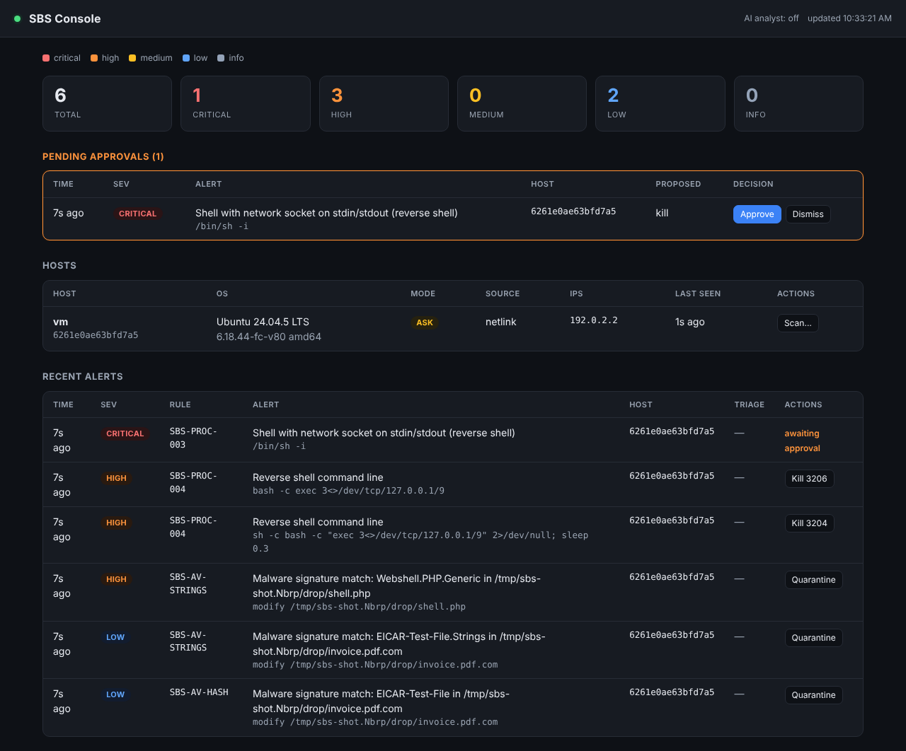

# SBS: Linux EDR with AI-assisted triage

SBS is an endpoint detection and response (EDR) / antivirus stack for Linux,
written in Go. A host agent detects and responds to threats; a central server
collects alerts and runs a web console; an AI analyst triages alerts, writes
detection rules from plain English, and summarizes incidents; and a benchmark
measures all of it against safe attack simulations.

- **`sbs-agent`** runs on each host: watches every process execution and changes
  to sensitive files, scans binaries and dropped files against malware
  signatures, evaluates detection rules, flags behavioral anomalies, and can
  automatically kill a process and quarantine a file on critical detections. It
  writes alerts as JSON lines and, optionally, uploads them to a server.
- **`sbs-server`** is the central collector and web console: agents authenticate
  with a bearer token and POST alerts and heartbeats; operators watch hosts and
  alerts on a dashboard and can issue response commands back to an agent.
- **AI analyst** (`internal/llm`) triages alerts into a verdict with reasoning,
  generates validated detection rules from a description, and narrates
  incidents. It runs on a **local Ollama model by default** (data stays on the
  box) or against the **Claude API**.
- **`sbs-bench`** replays harmless ATT&CK-mapped attacks and reports detection
  rate, time to detect, false positives, exec visibility and the agent's cost —
  with a built-in suite and an independent **held-out** suite for an honest number.

```
   each host                         central
 ┌─────────── sbs-agent ───────────┐        ┌──────────── sbs-server ───────────┐
 │ netlink/proc ─ process ─┐       │ alerts │  store (SQLite) ── web console     │
 │ inotify ───── file ─────┼─ rules┤ ─────► │       │                           │
 │               scanner ──┤ anomaly│ h'beat │   AI analyst (Ollama / Claude)    │
 │               response ◄┘ (kill, │ ◄───── │   triage · rules · incidents      │
 │               quarantine)        │ cmds   │                                   │
 └──────────────────────────────────┘        └───────────────────────────────────┘
```

## Quick start

Needs Go 1.24+ and Linux. The agent should run as root (or with `CAP_NET_ADMIN`) to get
kernel exec events; without it, it falls back to polling `/proc`.

```sh
make build                       # bin/sbs-agent, bin/sbs-server, bin/sbs-bench (static, no cgo)
sudo ./bin/sbs-agent run         # alerts to stdout, default watch list, auto-response on critical
sudo ./bin/sbs-agent run -config configs/agent.yaml -alerts /var/log/sbs/alerts.jsonl
./bin/sbs-agent scan /home /tmp  # on-demand antivirus scan, exit 1 on detection
./bin/sbs-agent rules            # list active rules
sudo make bench                  # writes reports/bench.{json,md}
```

Run the server and point an agent at it:

```sh
# central box — dashboard + API on localhost, agents authenticate with a token
SBS_AGENT_TOKEN=$(openssl rand -hex 16)
./bin/sbs-server -token "$SBS_AGENT_TOKEN"            # http://127.0.0.1:8080
./bin/sbs-server -token "$SBS_AGENT_TOKEN" -llm ollama  # + local AI triage
./bin/sbs-server -token "$SBS_AGENT_TOKEN" -llm anthropic  # + Claude API triage

# on each host — upload alerts and heartbeats to the server
sudo ./bin/sbs-agent run -config configs/agent.yaml   # set server.url/token in the config
```

To install as a service: copy the binary to `/usr/local/bin`, the config to
`/etc/sbs/agent.yaml`, and `deploy/sbs-agent.service` to `/etc/systemd/system/`.

An alert looks like this:

```json
{"time":"2026-10-09T09:10:01Z","rule_id":"SBS-PROC-003","title":"Shell with network socket on stdin/stdout (reverse shell)",
 "severity":"critical","mitre":["T1059.004","T1071"],
 "event":{"type":"process","source":"netlink","process":{"pid":4121,"ppid":4100,"uid":0,"exe":"/usr/bin/dash",
 "comm":"sh","cmdline":"/bin/sh -i","stdin":"inet","stdout":"inet","remote":"127.0.0.1:41235", "...": "..."}}}
```

## What it detects

| Layer | How | Examples |
|---|---|---|
| Process execution | Netlink process connector (every `exec`), enriched from `/proc`: exe, cmdline, parent, uid, cwd, and whether stdin/stdout is a TCP/UDP socket | reverse shells, `curl … \| sh`, base64 payloads, memfd/fileless execution, running from `/tmp`, `/etc/shadow` access, history and log wiping, SUID chmod, miners, webserver spawning a shell |
| File integrity | inotify on tagged paths | cron/systemd/init persistence, `authorized_keys`, `/etc/ld.so.preload`, passwd/sudoers, executables and SUID files in temp dirs |
| Signatures (AV) | SHA-256 hashes, plus YARA-style string sets (`any`, `all`, `N` of), text or hex, optional case-insensitive | EICAR, coin miners, reverse-shell scripts, Mirai strings, LD_PRELOAD rootkits, PHP webshells |

Every new process's binary is scanned when it runs, and every file written under a
watched path is scanned once it's closed. Results are cached by path, size and mtime.

### Rules

Rules are YAML, Sigma-style. Built-ins live in `assets/rules/` and are compiled into
the binary. Add your own with `rules:` in the config.

```yaml
- id: SBS-PROC-003
  title: Shell with network socket on stdin/stdout (reverse shell)
  severity: critical            # info | low | medium | high | critical
  mitre: [T1059.004, T1071]
  event: process                # process | file
  match:
    all:
      - field: process.name
        value: [sh, bash, dash, zsh, ksh, ash, busybox]
      - any:
          - {field: process.stdin, value: inet}
          - {field: process.stdout, value: inet}
```

Ops: `equals` (default), `contains`, `startswith`, `endswith`, `regex`, `exists`; `nocase: true`;
`value` can be a string or a list (any of). Nodes: `all`, `any`, `not`.

Fields:
`process.{pid,ppid,uid,exe,name,cmdline,cwd,stdin,stdout,remote}`,
`parent.{exe,name,cmdline}`, `file.{path,name,op,tag,size,mode,sha256}`, `event.{type,source}`.
`stdin`/`stdout` are `inet`, `socket` (Unix domain), `pipe`, `tty`, `file`, `null` or `none`.

### Signatures

```yaml
hashes:
  - {sha256: 275a021b…, name: EICAR-Test-File, severity: low}
signatures:
  - name: Linux.CoinMiner.Generic
    severity: high
    nocase: true
    strings: ["stratum+tcp://", "xmrig", "--donate-level", "hex:72616e646f6d78"]
    condition: "2"               # any | all | N
```

## Response

On a detection at or above `response.min_severity` (default `critical`), the agent
can **kill** the offending process (refusing pid ≤ 1, itself, and its own process
group) and **quarantine** a malicious file — moved into `quarantine_dir`, renamed by
content hash, stripped to mode `0000`. Quarantine refuses pseudo-filesystems, core
system trees, symlinks and non-regular files, and is symlink-race-safe.

`response.mode` picks how that happens:

| Mode | Behavior |
|---|---|
| `ask` (default) | The agent **proposes** the action and does nothing until a human **approves** it in the console. Nothing is killed without you. |
| `auto` | The agent acts **immediately** on a critical detection. Fastest containment. |
| `off` | Alert only; never acts. |

In `ask` mode the proposal appears in the console's **Pending approvals** panel;
**Approve** sends the derived command back to the agent (which executes it), **Dismiss**
drops it. Every executed action is recorded on the alert (`actions[]`). The console can
also issue `kill`/`quarantine`/`scan` manually; outside an approval the agent runs those
only when `remote_commands: true` (off by default).

## Server and console



`sbs-server` stores alerts and host state in SQLite (pure-Go, no cgo) and serves a
dependency-free web dashboard plus a JSON API on localhost: severity counts, a
**pending-approvals** panel, the host list (with each host's response mode), and recent
alerts with their AI triage verdict and action state. It auto-refreshes, works in light
and dark, and escapes all agent-supplied text (paths, command lines) safely.

Agents authenticate with a bearer token (`-token` / `SBS_AGENT_TOKEN`, constant-time
compared) and POST alert batches (gzip, idempotent by alert ID) and heartbeats; the
heartbeat response carries any queued commands. Uploads that fail are spooled to disk by
the agent and resent when the server returns, so alerts survive an outage.

**Operator auth & TLS.** Set `-console-token` (or `SBS_CONSOLE_TOKEN`) to require a login
(session cookie, `HttpOnly`/`SameSite=Strict`, rate-limited) before the console and its
API; `-tls-cert`/`-tls-key` serve HTTPS. The server refuses to bind a non-loopback
address with no console token unless `-insecure-no-auth` is set. Without a console token
it runs open and must stay on localhost.

## Fleet control

From the console you drive agents without touching them:

- **Live response mode** — switch a host between `off`/`ask`/`auto` from the Hosts table; the choice reaches the agent on its next heartbeat and the agent reports back the mode it is actually running. A console override may always **lower** an agent's mode (a safe kill switch), but may only **raise** it above the mode set in the agent's own config when that config opts in (`response.allow_server_override: true`) — so a compromised console can't turn a deliberately `off`/`ask` agent into an auto-killer. In `ask` mode the agent executes an approved kill/quarantine only when it matches a proposal it actually made.
- **Rule distribution** — write or AI-generate a detection rule, review the validated YAML, and deploy it. The server versions the enabled rule set; agents fetch and **hot-reload** it into the live engine without a restart, and report the version they loaded (and any load error). A bad rule keeps the previous engine.
- **Circuit breaker** — in `auto` mode an agent caps automatic kills/quarantines per minute (`response.max_auto_actions_per_minute`); if it trips, it drops to `ask` and flags `auto_response_tripped` in the console, so a bad distributed rule can't make it kill processes en masse.

## AI analyst

The analyst (`internal/llm`) adds three capabilities, all **advisory** — no AI output
ever triggers a response action on its own:

- **Triage** — classifies an alert (`malicious` / `suspicious` / `benign` / `unknown`) with a confidence, severity, one-line summary, reasoning and recommended actions. The server can auto-triage incoming alerts at or above a severity (`-auto-triage`, default `high`) in the background, or on demand from the console.
- **Rule generation** — writes a Sigma-style detection rule from a plain-English description and **validates it with the real rule engine**, retrying up to 3 times; it never reports a rule valid unless the engine parses it.
- **Incident summary** — narrates a group of related alerts into a timeline.

Two providers implement one interface:

- **Ollama (default)** — a local model (`-llm ollama`, default `http://localhost:11434`). Event data never leaves the host.
- **Claude API** (`-llm anthropic`) — uses `claude-opus-5-5` with adaptive thinking; needs `ANTHROPIC_API_KEY`.

Because command lines and file paths are attacker-controlled, every event-derived field
is run through a **secret redactor** (keys, tokens, PEM blocks) and wrapped in a
delimited *untrusted data* block in the prompt, with an instruction never to follow
instructions found inside it — a defense against prompt injection through telemetry.

## Benchmark

`sbs-bench` must run as root. Everything it does is harmless: network targets are
`127.0.0.1` (usually a closed port), files go only into a temp sandbox whose
directories carry the same tags as the real persistence locations, the reverse
shell connects to a listener inside the benchmark, and the "malware" is EICAR or
inert text.

Phases:

1. **Benign workload.** 45 normal admin commands (ls, tar, curl --version, base64 round-trips, chmod 644 …). Any alert counts as a false positive.
2. **Attack scenarios.** Techniques across execution, persistence, privilege escalation, defense evasion, credential access, C2 and impact. Each passes if an expected rule or signature fires within `-timeout` (3s). Three suites: the **built-in** set (17 scenarios), a first **held-out** set (`-heldout`, 16 scenarios) written from attacker behavior rather than the rules, and a second **blind held-out** set (`-heldout2`, 17 scenarios) across TTPs the first didn't cover.
3. **Exec burst.** 300 short-lived processes, to measure how many the agent actually sees.

The agent's CPU and RSS are sampled from `/proc` throughout. Auto-response and the
anomaly layer are disabled during the benchmark so it measures detection cleanly.

Flags: `-heldout`, `-heldout2`, `-only <name>`, `-source procfs|netlink`, `-load N`,
`-json`, `-md`, `-keep`, `-min-detection <0..1>` and `-max-fp <n>` (gates for CI).

Reference results from this repo's dev container (kernel 6.18):

| | built-in | held-out v1 | held-out v2 (blind) |
|---|---|---|---|
| Detection rate | 17/17 (100%) | **12/14 (86%)** | **1/16 (6%)** |
| Median time to detect | 1 ms | 1 ms | 1 ms |
| False positives | 0 / 45 | 0 / 45 | 0 / 45 |
| Short-lived exec visibility | 300/300 | 300/300 | 300/300 |

All on the netlink collector; `/proc` polling sees 0/300 short-lived processes, which is
why netlink (or eBPF) is the default. Full tables: [netlink](docs/benchmark-netlink.md),
[held-out v1](docs/benchmark-heldout.md), [held-out v2](docs/benchmark-heldout2.md).

**Read these numbers carefully.** The built-in 17/17 only shows the pipeline works
end to end — the rules and scenarios were written together. The **held-out suites are
the honest measure**: their scenarios were written from the attacker's side and allowed
to miss. Held-out v1 reaches 86% after closing four coverage gaps as general rule
classes; its two remaining misses are real agent limitations (an inotify race on a
freshly-created deep directory, and a preload watch scoped to the exact filename).
**Held-out v2 sits at 6% by design** — it is a blind set over techniques SBS has no
rules for yet (discovery, LOLBins, container escape, exfil, env-based `LD_PRELOAD`,
timestomping), so it maps the true coverage frontier. Track both as rules improve;
0 false positives throughout is as important as the detection rate.

CI (`.github/workflows/ci.yml`) runs unit tests and then the benchmark as root, fails on
any missed detection or false positive, and puts the Markdown report in the job summary.

## Layout

```
cmd/sbs-agent            agent CLI (run, scan, rules, version)
cmd/sbs-server           server + web console CLI
cmd/sbs-bench            benchmark CLI
internal/collector/proc  netlink exec events, /proc polling, process enrichment
internal/collector/ebpf  CO-RE eBPF exec collector (build with -tags ebpf)
internal/collector/fs    inotify watcher
internal/scanner         hash + string signature engine
internal/rules           rule engine
internal/anomaly         behavioral anomaly layer (new-binary, fan-out)
internal/response        kill + quarantine actions
internal/agent           pipeline, dedup, response, live mode, rule hot-reload
internal/transport       agent→server client with offline spooling + TLS
internal/api             agent/server wire types
internal/store           SQLite persistence (server)
internal/server          HTTP API + console auth + embedded dashboard
internal/llm             AI analyst: interface, Ollama, Claude, mock, redactor
internal/bench           scenarios (built-in + 2 held-out suites), runner, reports
assets/                  built-in rules and signatures (embedded)
configs/                 example agent config
deploy/, scripts/        systemd units, Docker/compose, install scripts
```

## Deploy

`deploy/README.md` has the full ops guide. Quick start with Docker (server + a local
Ollama for triage):

```sh
./scripts/gen-tokens.sh --write     # writes .env (agent + console tokens)
docker compose up -d --build        # server on 127.0.0.1:8080, ollama alongside
docker compose exec ollama ollama pull llama3.1
```

Install an agent on a host with `scripts/install-agent.sh` (systemd unit, config, state
dirs). Build with eBPF support: `go build -tags ebpf ./cmd/sbs-agent` (needs a recent
kernel with BTF and `CAP_BPF`; see `internal/collector/ebpf/BUILD.md`).

## Known limits and next steps

- **Exec race (reduced, not gone).** The netlink collector reports a PID and the agent then reads `/proc`, so a process that exits within microseconds can be gone first. The **eBPF collector** (`-tags ebpf`, `sched_process_exec`) captures pid/comm/filename in the kernel and closes most of that gap; extending it to argv and per-process network/file events is the next step.
- **Response is reactive, not blocking.** Kill happens after exec, so a fast payload may run first. True prevention needs `fanotify` permission events or an LSM/eBPF hook.
- **Signatures are basic.** The matcher uses `bytes.Contains`; Aho-Corasick or real YARA (cgo + libyara) would scale to large rule sets.
- **Trust model.** An agent trusts its server (for live mode and distributed rules); the circuit breaker bounds the blast radius of a bad rule, and TLS + tokens protect the channel, but a compromised server can still disable response or push noisy rules. Next: signed rule sets and agent tamper protection.
- **AI is advisory and non-deterministic.** Triage/rule-gen quality depends on the model; a local Ollama model is weaker than Claude. Outputs never drive automated response and generated rules are operator-reviewed. Add an eval set to track quality over time.
- **Detection frontier.** Held-out v1 is 86% (two honest limitations remain); held-out v2 is 6% — a map of uncovered TTPs (discovery, LOLBins, container escape, exfil, env-based `LD_PRELOAD`, timestomping) and the clearest backlog of rule work.
- **Server is single-node; SIEM export (syslog/Kafka) and multi-tenant auth are not built.**
- **Linux only.** Windows would need ETW and a different collector set.
